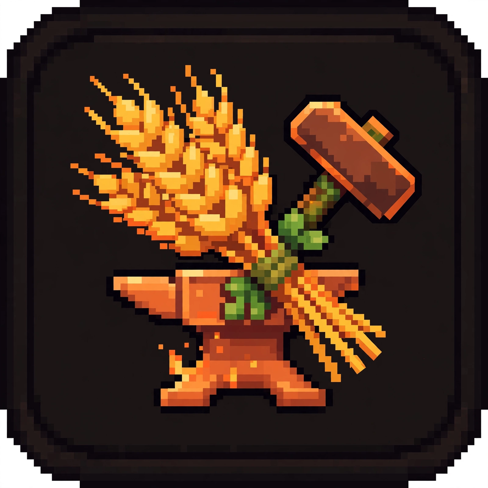

<p align="center">
  
</p>

<h1 align="center">ForgeFarms</h1>

<p align="center"><i>Automated player-owned farms for Paper — crops, trees, and stalk farms that plant, grow, harvest, store, and sell on their own. Trust roles, hopper automation, and holograms are built in: zero paid dependencies.</i></p>

<p align="center">
  
  
  
  
  
  
</p>

<p align="center"><sub>Not affiliated with <a href="https://minecraftforge.net">MinecraftForge</a> — "Forge" is just a name.</sub></p>

---

Place a farm item and it becomes a working farm: crops accelerate and auto-harvest inside the radius, trees are felled the moment they mature and replanted, sugar cane and cactus are cut above the base block. Harvests flow through composable outputs — virtual storage, adjacent containers, economy auto-sell — in your priority order. Everything the premium farming plugins charge extra for (protection, hopper upgrades, holograms) is native.

An original implementation written from scratch for Paper 26.3. Folia-compatible from day one (per-region async ticks, no region-unsafe calls). No deprecated API usage — the build fails on any deprecation warning.

## Feature highlights

- **Automated farms** — place a farm item to create a farm core; growth ticks sample random blocks in the radius, accelerate ageable crops, and harvest into the output pipeline
- **Crop, tree & stalk farms** — ageable crops (wheat, carrots, potatoes, beetroots…), stem fruit (melon/pumpkin), stalks (sugar cane, cactus, bamboo, kelp), and full tree farms via `StructureGrowEvent` capture with automatic replanting
- **Trust system (built in)** — roles (Owner/Admin/Member/Guest) with granular flags: block break/place, harvest, plant, interact, upgrade, fuel, configure, delete. Replaces paid ChestProtect-style dependencies
- **Hopper automation (built in)** — harvests push into any container adjacent to the farm core. No hopper-upgrade item needed. Replaces paid UpgradeableHoppers-style dependencies
- **Holograms (built in)** — floating `TextDisplay` holograms above each farm core with live fuel/storage/radius placeholders. No armor stands, no HolographicDisplays. Replaces paid hologram dependencies
- **Independent upgrade tracks** — radius, speed, storage, and fuel-efficiency level separately (no bundled farm levels), each with per-level money and/or item costs
- **Composable outputs** — storage + hopper + auto-sell run simultaneously in a configurable priority order, not one-or-the-other
- **Offline catch-up** — farms simulate growth while the owner is offline (capped hours per type) instead of hard-pausing
- **Fuel system** — feed coal/charcoal (configurable) into the farm; efficiency upgrades stretch every item
- **One config per farm type** — `farm-types/*.yml` defines everything; ships with wheat, oak (trees), sugarcane (stalks), and melon (stem fruit)
- **In-game GUIs** — main menu, virtual storage (click to withdraw), fuel gauge, upgrade shop, member manager
- **SQLite + MySQL** — JDBC drivers shaded into the jar, zero setup; `/farmadmin migrate` copies between backends, `backup`/`restore` with no restart required
- **Public Java API + events** — `ForgeFarmsAPI` plus `FarmCreateEvent`, `FarmHarvestEvent`, `FarmFuelEmptyEvent`, `FarmStorageFullEvent`, `FarmUpgradeEvent`, `FarmRemoveEvent`
- **PlaceholderAPI** — `%forgefarms_farms_owned%`, `%forgefarms_farms_limit%`, `%forgefarms_farm_fuel_<id>%`, `%forgefarms_farm_storage_<id>%`

## Quick start

1. Drop the jar in `plugins/` and restart. Four farm types load out of the box.
2. `/farm get wheat` — then right-click a block to place the farm.
3. Hold coal and right-click the farm core to fuel it.
4. Right-click the core to open the management GUI.

## Commands

### /farm

| Command | Description | Usage |
|---|---|---|
| `/farm get` | Get a farm item. | `/farm get <type> [amount]` |
| `/farm list` | List your farms with fuel status. | `/farm list` |
| `/farm menu` | Open the management GUI for a farm. | `/farm menu [id]` |
| `/farm trust` | Add a member to your nearest farm. | `/farm trust <player> [GUEST\|MEMBER\|ADMIN]` |
| `/farm untrust` | Remove a member. | `/farm untrust <player>` |
| `/farm tp` | Teleport to one of your farms. | `/farm tp <id>` |
| `/farm help` | Show help. | `/farm help` |

Aliases: `/farms`, `/forgefarms`.

### /farmadmin

| Command | Description | Usage |
|---|---|---|
| `/farmadmin give` | Give a farm item to a player. | `/farmadmin give <player> <type> [amount]` |
| `/farmadmin reload` | Reload configs and farm types. | `/farmadmin reload` |
| `/farmadmin migrate` | Copy all data to another backend. | `/farmadmin migrate <sqlite\|mysql>` |
| `/farmadmin backup` | Snapshot the database to `backups/`. | `/farmadmin backup` |
| `/farmadmin restore` | Restore a backup, no restart needed. | `/farmadmin restore <file>` |
| `/farmadmin limits` | Show config limits and status. | `/farmadmin limits` |
| `/farmadmin remove` | Delete a farm by id. | `/farmadmin remove <id>` |
| `/farmadmin list` | List all farms (optionally one player's). | `/farmadmin list [player]` |

Alias: `/fadm`.

## Permissions

| Permission | Description | Default |
|---|---|---|
| `forgefarms.command.get` | `/farm get` | true |
| `forgefarms.command.list` | `/farm list` | true |
| `forgefarms.command.help` | `/farm help` | true |
| `forgefarms.upgrade` | Buy farm upgrades | true |
| `forgefarms.teleport` | `/farm tp` | op |
| `forgefarms.bypass.protection` | Edit any farm | op |
| `forgefarms.bypass.fuel` | Farms never run out of fuel | op |
| `forgefarms.bypass.limits` | Ignore farm caps | op |
| `forgefarms.bypass.*` | All bypasses | op |
| `forgefarms.admin` | `/farmadmin` everything | op |

## Configuration

`config.yml` — database backend, global limits, hologram refresh rate, auto-sell prices:

```yaml
database:
  type: sqlite        # or mysql (driver bundled)
  mysql: { host, port, database, user, password, use-ssl }
limits:
  max-farms-per-player: 3
  max-members-per-farm: 10
hologram:
  refresh-ticks: 100
prices:               # per-item auto-sell prices (needs Vault + economy)
  WHEAT: 1.0
```

`farm-types/<id>.yml` — one file per farm type: display name, core block, item, base radius / tick interval / growth attempts / storage slots, fuel items and burn time, harvestable blocks with behaviors (`AGEABLE_CROP`, `STEM_FRUIT`, `STALK`), tree-farming toggle with allowed saplings, offline catch-up cap, hologram lines with placeholders (`{owner}`, `{type}`, `{fuel}`, `{fuel_percent}`, `{storage_used}`, `{storage_slots}`, `{radius}`), drama tuning (`age-per-sample`, `harvest-sweep`, `max-harvests-per-tick`, and an `effects:` block with harvest/growth particles and sounds), and the four upgrade tracks with per-level effects and costs.

### Upgrade tracks

Each track is a list of levels; farms buy them independently:

- **radius** — effect = working radius in blocks
- **speed** — effect = growth tick interval (lower is faster)
- **storage** — effect = virtual storage slots
- **efficiency** — effect = fuel multiplier

```yaml
upgrades:
  radius:
    levels:
      - { effect: 6, cost-money: 500.0, description: "Radius 6" }
      - { effect: 8, cost-money: 1500.0 }
```

Costs accept `cost-money` (Vault economy — ForgeCore registers one natively, so no separate Vault install needed), `cost-item: { material, amount }`, `cost-xp-levels: N`, or any combination (all specified costs are charged together). Omit all three for a free level.

## API

```java
// Static access (after ForgeFarms enables)
ForgeFarmsAPI.isAvailable();
Farm farm = ForgeFarmsAPI.getFarmAt(location);
ItemStack item = ForgeFarmsAPI.createFarmItem("wheat", 1);

// Events
@EventHandler
public void onHarvest(FarmHarvestEvent e) {
    e.getDrops().add(new ItemStack(Material.DIAMOND)); // farms can drop anything
}
```

## Building

Direct `javac` (the Gradle daemon cannot run in sandboxed CI):

```bash
./build.sh   # -Werror -Xlint:all, shades SQLite + MySQL drivers
```

Requires JDK 25 and the Paper 26.3 API on the toolchain path (see `build.sh`). PlaceholderAPI is compile-only.

## License

MIT — do whatever you want with it, credit appreciated.
